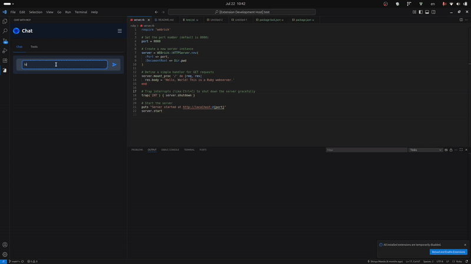

# Example: Remote Model Context Protocol (MCP) Server without SDKs

This repository demonstrates the minimal example of MCP client and remote server implementations.
It follows [Model Context Protocol spec](https://modelcontextprotocol.io/introduction)
**without** relying on official or 3rd party MCP SDKs, so that you can examine the low-level details of
MCP flow, including authentication and authorization via OAuth2.1.
This is mainly for enterprise software/server that can't use MCP SDKs as-is due to the existing server stack and business logic.

This demo uses [Streamable HTTP](https://modelcontextprotocol.io/specification/2025-06-18/basic/transports#streamable-http) for the **remote** MCP Server implementation, which allows you to **unify** your data server and MCP server.
This demo does NOT use the [stdio transport](https://modelcontextprotocol.io/docs/concepts/transports#standard-input%2Foutput-stdio) which is designed for the "local" MCP server.
There are several reasons why it's preferred to go after a **remote** MCP Server rather than a local MCP Server. See [Why should we introduce remote MCP server?](#why-should-we-introduce-remote-mcp-server) for more information.

While this demo is written in Python as backend server and Vue.js as frontend server,
the implemented logic can be translated/adopted into the other programming language
where the SDKs might not support yet.

## Getting started

### Run chat on VS Code extension

1. [Run backend server](./backend/README.md#start-server).
1. [Build webview](./webview/README.md#compile-and-minify-for-production-and-chat-extension).
1. [Build language server](./language-server/README.md).
1. [Run chat extension](./chat-extension/README.md#run-extension)

### Run chat on browser

1. [Run backend server](./backend/README.md#start-server).
1. [Run webview server](./webview/README.md#compile-and-hot-reload-for-development).
1. Access http://localhost:5173/ in a browser.

## Overview

This demo is based on the latest MCP spec described in https://modelcontextprotocol.io/specification/2025-06-18.

- It supports OAuth2.1 flow according to https://modelcontextprotocol.io/specification/2025-06-18/basic/authorization#2-2-example%3A-authorization-code-grant. This auth flow supports PKCE (generating code challenge with SHA256) as it's required in OAuth 2.1.
- The frontend component represents:
  - **MCP Host** and **MCP Client** in [MCP glossary](https://modelcontextprotocol.io/introduction).
  - **Client** in [OAuth glossary](https://datatracker.ietf.org/doc/draft-ietf-oauth-v2-1/).
- The backend component represents:
  - **MCP Server** and **Local Data Source** in [MCP glossary](https://modelcontextprotocol.io/introduction).
  - **Resource server** and **Authorization server** in [OAuth glossary](https://datatracker.ietf.org/doc/draft-ietf-oauth-v2-1/).
  - The dummy user in the in-memory database is called **Resource owner** in [OAuth glossary](https://datatracker.ietf.org/doc/draft-ietf-oauth-v2-1/).

Here is the auth flow:

1. A user visits the web site. If authorization is not done yet, it's redirected to the authorization server (`GET /authorize` endpoint).
1. The user logins to the authorization server (`POST /login` endpoint). If it's successful, it's redirected to the callback URL in the frontend (`http://localhost:5173/callback`).
1. Frontend requests to `POST /token` endpoint to generate an access token (JWT).
1. Frontend requests to the MCP endpoint, either `POST /mcp` or `GET /mcp` with the bearer token authentication.

## Why should we introduce remote MCP server?

Model Context Protocol  takes some inspiration from the [Language Server Protocol](https://microsoft.github.io/language-server-protocol/), which is mentioned in https://modelcontextprotocol.io/specification/2025-06-18:

> MCP takes some inspiration from the Language Server Protocol, which standardizes how to add support for programming languages across a whole ecosystem of development tools. In a similar way, MCP standardizes how to integrate additional context and tools into the ecosystem of AI applications.

LSP is a great abstraction for [minimizing the frictions between programming languages and code editors](https://code.visualstudio.com/api/language-extensions/language-server-extension-guide), and
most of the cases Language Server is launched as a **local** server. However, MCP is not necessary to follow the same pattern, because:

- Editor extensions mainly requires local data in the user's computer, such as parsing code and annotate in VS Code. Most of the time, it doesn't need to interact with remote data.
- MCP Hosts requires **both** local data in the user's computer **and** user's remote-and-private data in a remote service. Both local and remote environment/context are interactable by LLM agent.

Due to this different nature of data access patterns, it's better to design the separate of concerns in the following way:

- Remote MCP servers are for accessing remote context, only.
  - Private data servers should provide MCP integration capability via Streamable HTTP. This ensures that the MCP Server _as a plugin to the MCP Host_ can only interact with the remote context, which doesn't conflict responsibilities of the local context handler.
- Local MCP servers are for accessing local context, only.
  - Acceccing local context _can_ be handled by a local MCP server _or_ could be a part of the business logic of MCP Host (e.g. Cursor).
  - Local context handler can interact with user's local environment e.g. Create a file in a local file storage.
  - Local context handler can be combined with N remote MCP servers e.g. Edit a file with a local MCP server. Push the change to GitHub via remote GitHub MCP server or to GitLab via remote GitLab MCP server.
  - Local context handler shouldn't interact with remote context in order to respect the boundaries of remote MCP servers.
- MCP Host / LLM decide which tool should be executed to resolve the user's input.

In addition, there are several reasons why it's preferred to go after a remote MCP Server rather than a local MCP Server, for example:

- **Backward compatibility**: In the local MCP server, you have to hard-code the API requests to your data server. When you change the API spec of your data server, the local MCP Server could stop working because the API requests are incompatible. Unifying the MCP server and your data server minimizes this risk.
- **Extensibility & Maintanability**: In the local MCP server, when it needs a specific context data from your data server, you have to implement a corresponding API at first. Unifying the MCP server and your data server reduces this friction.
- **Classification**: With the local MCP server, it requires the API of your data server to be public. With the remote MCP server, it exposes only a few endpoints for the MCP transport.
- **Telemetry**: With the local MCP server, you might not be able to track data usage by LLM because servers can't differentiate the requester type (e.g. Is it an automation in CI or MCP tool calling?). Centralizing the access to the MCP's endpoints allows you to track it.
